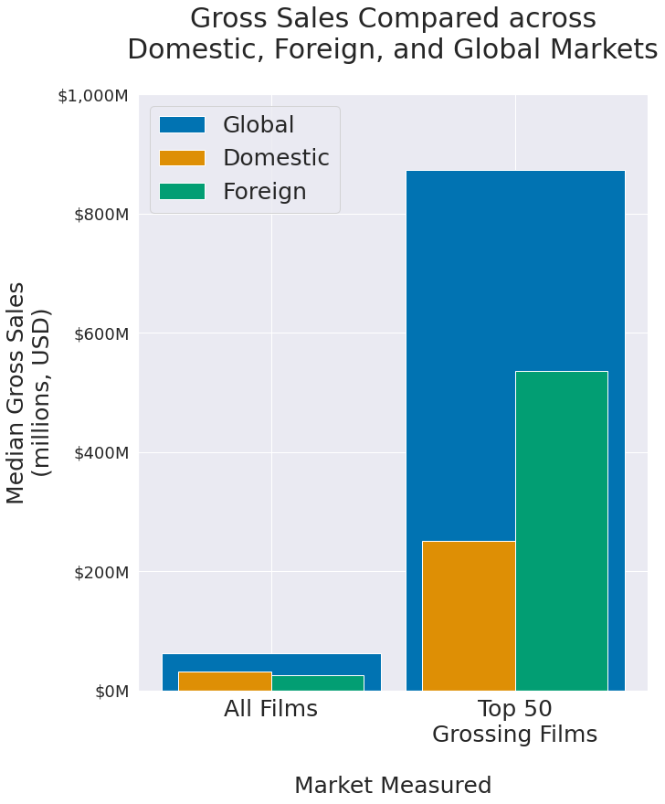

# Microsoft Movie Studios Initial Pitch


<sup>(source. https://microsoft.com)</sup>

## Overview
This project reviews data from IMDB and TheNumbers.com to find the potential most equitable actions that can be taken to produce equitable content by looking at director history, reviewing the domestic, foreign, and global markets, and analyzing budgets against profit margins.

## Business Understanding
Microsoft is looking to produce original video content by opening a new studio. The studio is looking to start off strong with high-value titles from the beginning and justify the studio's initial cost to open.

## Data Understanding

Data used is from IMDB and TheNumbers.com.

IMDB is one of the biggest and detailed database on movie data. We specifically focused on movie_basics, movie_akas, directors, and persons table from IMDB. Budget data was taken from TheNumbers which provided data on production budget, domestic gross earnings, and worldwide gross earnings. 

We beleive that the "success" of a film can be measured by the revenue that it brings in and some big variables that affect the success of a film's directors, the film's market, and the film's budget.

TheNumbers has an extensive database of movies matched to their budgets and gross revenues.

## Methods

This project uses descriptive analysis in several forms to attempt to understand major success indicators and correlations within the movie industry to identify potentially useful strategies for producing a successful first film.


## Results

Some directors have experience in creating highly profitable films. In recent years, Colin Trevorrow (the director of 2 of the recent _Jurassic World_ films) has been able to generate a median of \$1.4 billion in profit in his films. The next-highest slot in this list was nearly \$350 million dollars behind him.


In much of the movie industry, domestic markets hold a slight edge over foreign markets, but a look at the most successful movies reveals that there is a lot of importance in the foreign market as well. Nearly two thirds of the profit generated from the top 50 films comes from the foreign market.



An investigation into global profit margins against production budgets shows that there is a slight positive correleationg between budget and profit, with less data being consistent and available as budgets increase.


## Conclusions

Moving forward, Microsoft should reach out to Colin Trevorrow (_Jurassic World_) to collaborate on the production of a mid-to-high-budget film. Accessibility of this film should be a major goal as part of this project, to allow it to be introduced to a wide, global audience.

- Based on our investigation, mister Trevorrow has a solid chance at producing a highly-profitable movie as evidenced by the most recent decade of releases.
- Among the highest-grossing films, the foreign market hold a very strong presence in terms of the profit that is generated.
- Higher budgets appear to lead to higher margins, though data for extremely high-budget films is somewhat lacking, so it's important to keep this is mind when managing risk.

## Next Steps

Though we believe heavily in the results of our investigation, there were some shortcomings in the data we were able to use. Provided we have more time and additional resources, there are a few steps we would be able to take to improve on the information provided in this report.

1. **A more closely related, cleaner dataset.** The datasets we used were from two different sources. In order to get the names, numbers, and all other data to tie together, we had to base some data combination on movie titles. These can be input differently from different sources and it makes it difficult to automatically bring the two sources together. It may be possible to generate a budgets list with IMDB movie IDs, for instance. This will have to be investigated.
2. **The addition of recent major releases.** There were a few key releases that came out after our datasets were published. _Avatar: Way of Water_, for instance may have strongly effected both the directors category and the budget and profit analysis. Without research into this, it's difficult to tell.
3. **Gathering additional useful information.** There are many key factors in a successful movie release. Here, we were able to investigate three major ones. Given more time and perhaps more insight, additional indicators such as popular IPs, genre, and seasonality could be researched to maximize various success factors.

## For Inquiries, Business Proposals, or Additional Information...

Our process is available in this [Jupyter Notebook](./microsoft_movie_studio_investigation.ipynb) or abbreviated in this [presentation](./REPLACE_ME.pdf).

We can be contacted via email at [alisonsjpark@gmail.com \(Alison\)](mailto:alisonsjpark@gmail.com) or [jmentz@gmx.com \(JD/Jefferson\)](mailto:jmentz@gmx.com)


## Repository structure

```
├── code
│   └── rm
├── data
│   ├── im.db
│   ├── im.db.zip
│   └── tn.movie_budgets.csv.gz
├── images
│   ├── db_schema.jpeg
│   ├── market_investigation.png
│   ├── microsoft_hq.png
│   ├── movie_directors_and_profit_margins.png
│   └── movie_profits_based_on_budget.png
├── LICENSE
├── microsoft_movie_studio_investigation.ipynb
└── README.md
```


